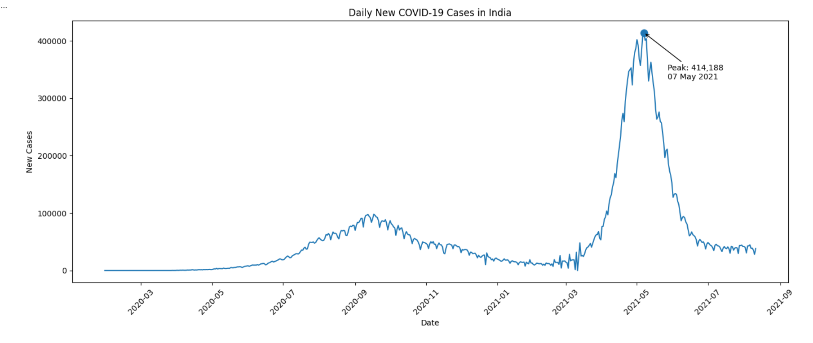
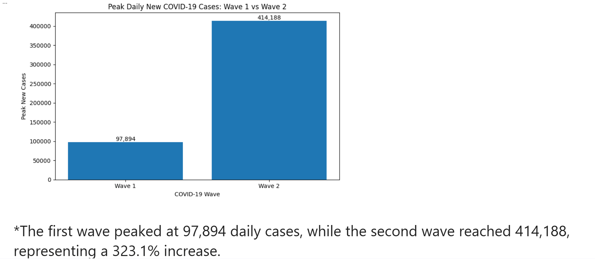
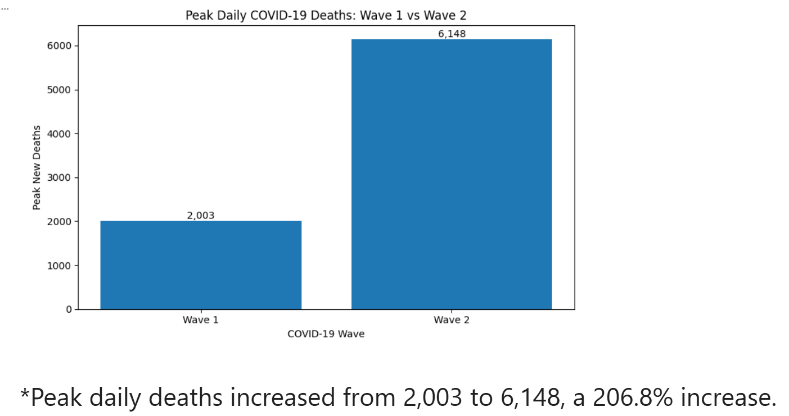
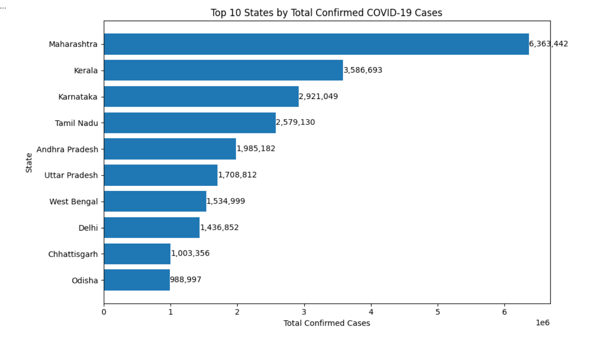
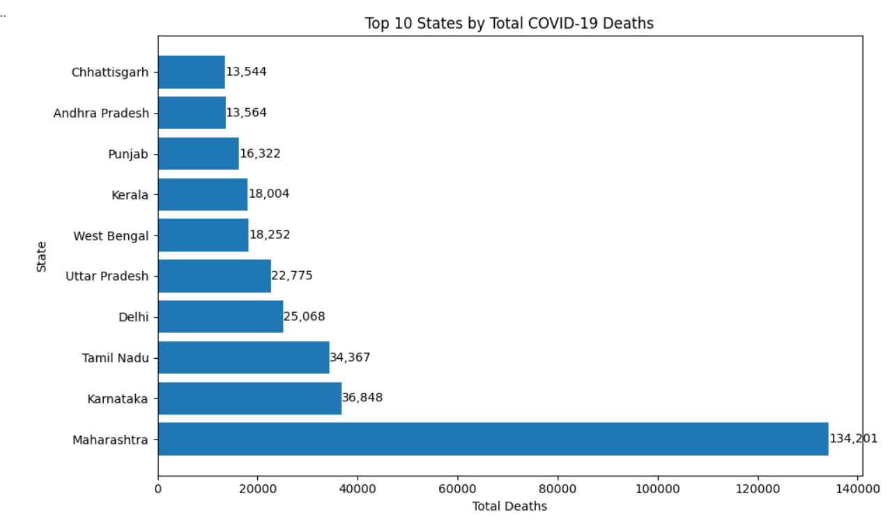
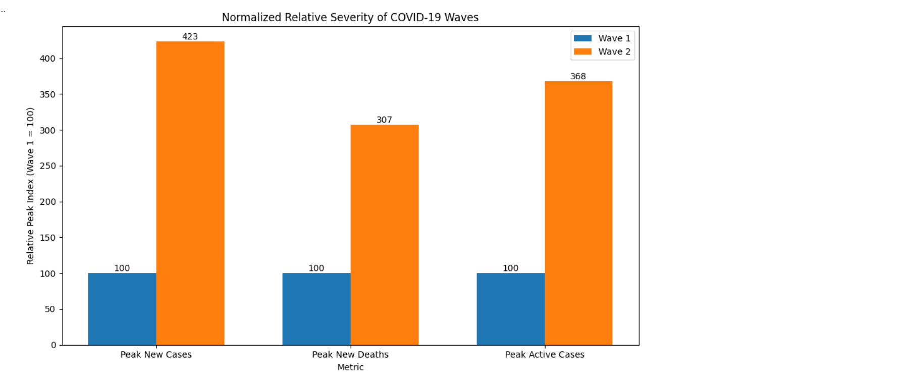
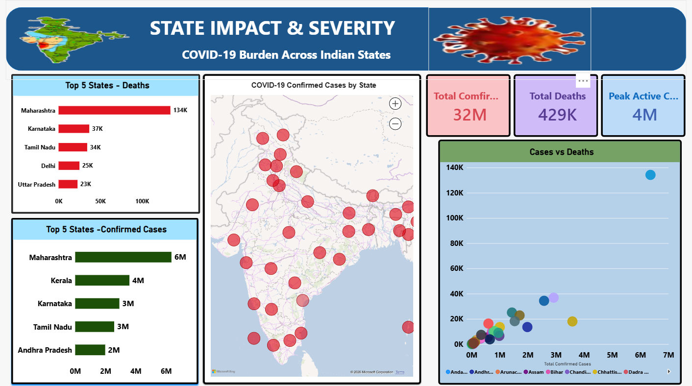

## COVID-19 Impact, Testing & Vaccination Analysis in India

An end-to-end data analytics project using Python and Power BI to analyze COVID-19 impact, testing patterns, vaccination trends, and state-wise healthcare burden across India.

## 📌 Project Overview

The COVID-19 pandemic affected different states and regions of India at different levels and time periods.

This project analyzes COVID-19 data to understand:

- COVID-19 infection and recovery trends
- State-wise COVID-19 impact
- Active cases and healthcare burden
- Deaths and case fatality
- Testing patterns and positivity rates
- Vaccination trends
- Major COVID-19 waves and unusual observations

The project uses **Python** for data cleaning, validation, exploratory analysis, and insight generation, followed by **Power BI** for interactive dashboard development.

## 🎯 Problem Statement

During the COVID-19 pandemic, understanding how infection levels, testing, vaccination, and healthcare burden varied across India was important for identifying major trends and regional differences.

The objective of this project is to analyze historical COVID-19 data and generate meaningful insights that can support better understanding of:

- When major COVID-19 waves occurred
- Which states experienced higher COVID-19 impact
- How testing and positivity patterns changed
- How vaccination progressed over time
- Where healthcare burden was comparatively high

## 🎯 Project Objectives

1. Clean and validate the COVID-19 dataset using Python.
2. Analyze COVID-19 trends across time.
3. Compare state-wise COVID-19 impact and severity.
4. Analyze testing and positivity patterns.
5. Analyze vaccination trends.
6. Identify major COVID-19 waves and significant observations.
7. Build an interactive Power BI dashboard.
8. Generate data-driven recommendations from the analysis.

## 🛠️ Tools & Technologies

- **Python**
- **Pandas**
- **NumPy**
- **Matplotlib**
- **Seaborn**
- **Power BI**
- **Google Colab**


## 🔄 Project Workflow

```text
Data Collection
      ↓
Data Cleaning & Formatting
      ↓
Data Validation
      ↓
Missing Value Analysis
      ↓
Outlier Analysis
      ↓
Exploratory Data Analysis
      ↓
Insight Generation
      ↓
Power BI Dashboard
```


## 📈 Exploratory Data Analysis

Python was used to perform exploratory data analysis to identify COVID-19 trends, wave patterns, state-wise impact, and severity differences.

### Daily COVID-19 Cases Trend



### Wave 1 vs Wave 2 — Peak Cases



### Wave 1 vs Wave 2 — Peak Deaths



### Top 10 States by Confirmed Cases



### Top 10 States by COVID-19 Deaths



### COVID-19 Wave Severity Comparison



## 📊 Power BI Dashboard

### Page 1 — India_Covid19_Overview


### Page 2 — State Impact & Severity



### Page 3 — Testing & Vaccination


The Power BI dashboard presents the major findings from the analysis through interactive visualizations.

🔍 Key Analysis Areas
### 1. COVID-19 Trend & Wave Analysis

The analysis examines COVID-19 case, recovery, death, and active-case trends over time to identify major waves and periods of increased disease burden.

### 2. State-wise Impact & Severity

State-level analysis is used to compare COVID-19 impact and severity across different regions of India.

### 3. Testing Analysis

Testing volume and positivity-related metrics are analyzed to understand testing patterns and COVID-19 detection trends.

### 4. Vaccination Analysis

Vaccination data is analyzed to understand vaccination progression and differences across states and over time.

### 5. Outlier Analysis

Statistical analysis is used to identify unusual observations in important COVID-19 metrics such as new cases, new recoveries, new deaths, active cases, and testing volume.

## 💡 Recommendations

Based on the analysis, the project highlights the importance of:

. Monitoring regional COVID-19 trends continuously.

. Strengthening healthcare preparedness during periods of increasing active cases.

. Maintaining adequate testing capacity during infection surges.

. Monitoring positivity rates alongside testing volume.

. Supporting vaccination coverage in regions with comparatively lower vaccination levels.

. Using historical wave and state-level patterns to improve preparedness for future outbreaks.

## 📂 Dataset

The project uses COVID-19 data covering COVID-19 cases, recoveries, deaths, testing, and vaccination-related indicators across Indian states and dates.

The repository contains the datasets used for the analysis under the data/ folder.

## 📁 Project Structure

```text
COVID-19-Impact-Testing-Vaccination-India/
│
├── EDA_Visualizations/
│   ├── covid19_wave_severity_comparison.png
│   ├── daily_covid19_cases_trend.png
│   ├── top10_states_confirmed_cases.png
│   ├── top10_states_covid_deaths.png
│   ├── wave1_vs_wave2_cases.png
│   └── wave1_vs_wave2_deaths.png
│
├── data/
│   ├── covid19_india_cleaned_dataset.csv
│   └── covid19_india_raw_dataset.csv
│
├── documentation/
│   └── COVID19_Impact_Testing_Vaccination_Analysis_documentation.pdf
│
├── images/
│   ├── Covid19_State_impact_severity.png
│   ├── Covid19_Testing_vaccination.png
│   └── India_covid19_overview.png
│
├── notebooks/
│   └── covid_india_project_python_code.ipynb
│
├── powerbi/
│   └── Covid_India_dashboard.pbix
│
└── README.md
```

## ▶️ Project Files

- 🐍 [Python Analysis Notebook](notebooks/covid_india_project_python_code.ipynb)
- 📊 [Power BI Dashboard](powerbi/Covid_India_dashboard.pbix)
- 📄 [Project Documentation](documentation/COVID19_Impact_Testing_Vaccination_Analysis_documentation.pdf)
- 📈 [EDA Visualizations](EDA_Visualizations/)
- 📁 [Datasets](data/)
- 📷 [Dashboard Screenshots](images/)
  ```

## 👤 Author

**poojitha jakkula**

*Data Analyst | Data Science Enthusiast*
